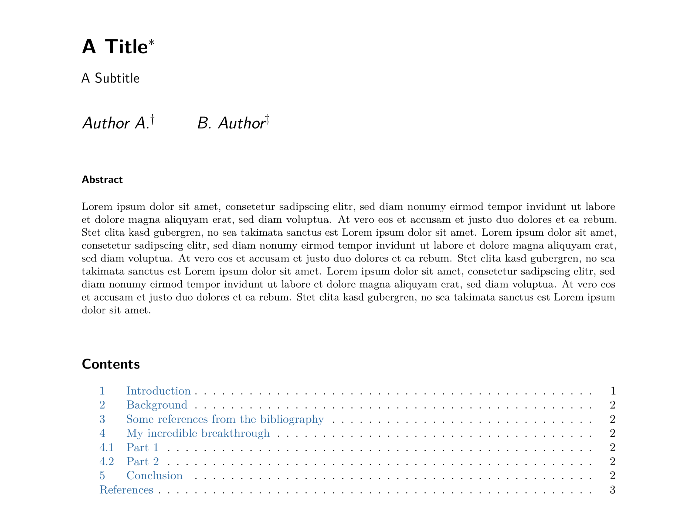

We've been learning about ***only some*** the posibilities that Markdown+Pandoc offers to write our research paper. But that is just only one part of the story. Many more questions should be arising at this point:

1. My paper should have an abstract, where do I put it?
2. What if I want to change the margins of my page? Or my paper size?
3. or if there is more than one author in the paper?
4. Maybe I want to have a 2 column paper,
5. or someone provided me a LaTeX template.
6. Maybe I'm writting a PhD and I need a more 'book-like' structure...
7. What if... maybe... what if... maybe...

***NO WORRIES!*** Here is where the power of YAML comes in.

If you have been following up to this point, you should have a YAML Frontmatter in your `.md` file that looks like this:

```yaml
---
title: 'A Title'
author: 'An Author'
date: 'The Future'
bibliography: Your_Bib_File.bib
---
```

Let's have a look at a more complex YAML:

```yaml
---
# LaTeX package includes
# Use this to include packages required usually in custom templates.
header-includes:
  \usepackage[multiple]{footmisc}
  \usepackage{svg}
  \usepackage{svgcolor}
  \usepackage{algorithms}

# Enable PDF Links
link-citations: true
link-references: true

# Select color for each type of link
colorlinks: true
linkcolor: NavyBlue
toccolor: NavyBlue
citecolor: NavyBlue
urlcolor: NavyBlue

# Geometric aspects
papersize: A4
margin-left: 1in
margin-right: 1in
margin-top: 1in
margin-bottom: 1in
fontsize: 10pt

# TOC, LOF, LOT
toc: true # Enable table of contents at the beginning of the document
toc-depth: 2 # Index depth
lof: true # Enable list of figures at the beginning of the document
lot: true # Enable list of tables at the beginning of the document

#---- DOCUMENT META-DATA ------
title: "A Title"
subtitle: "A Subtitle"
institution: "University of Whatever"
author: Author A., B. Author
date: Aug 2959

# Abstract for your research
abstract:
  Lorem ipsum dolor sit amet, consetetur sadipscing elitr, sed diam nonumy eirmod tempor invidunt ut labore et dolore magna aliquyam erat, sed diam voluptua. At vero eos et accusam et justo duo dolores et ea rebum. Stet clita kasd gubergren, no sea takimata sanctus est Lorem ipsum dolor sit amet. Lorem ipsum dolor sit amet, consetetur sadipscing elitr, sed diam nonumy eirmod tempor invidunt ut labore et dolore magna aliquyam erat, sed diam voluptua. At vero eos et accusam et justo duo dolores et ea rebum. Stet clita kasd gubergren, no sea takimata sanctus est Lorem ipsum dolor sit amet. Lorem ipsum dolor sit amet, consetetur sadipscing elitr, sed diam nonumy eirmod tempor invidunt ut labore et dolore magna aliquyam erat, sed diam voluptua. At vero eos et accusam et justo duo dolores et ea rebum. Stet clita kasd gubergren, no sea takimata sanctus est Lorem ipsum dolor sit amet.
# Thanks section will appear as a footnote of the title in the default template. If you don't like this you can just erase it.
thanks:
  Lorem ipsum dolor sit amet, consetetur sadipscing elitr, sed diam nonumy eirmod tempor invidunt ut labore et dolore magna aliquyam erat, sed diam voluptua. At vero eos et accusam et justo duo dolores et ea rebum. Stet clita kasd gubergren, no sea takimata sanctus est Lorem ipsum dolor sit amet.
# Insert keywords here
keywords: some, keywords, for, your, paper.
# Put your bibliography filename here. You can put relative paths if the file is inside a folder in your working directory, or even the complete file path.
bibliography: YOUR_BIBLIOGRAPHY_FILE.bib

# DO NOT TOUCH THIS
# CHANGE LATEX ENGINE FOR  PDF OUTPUT
output:
  pdf_document: 
    latex_engine: xelatex # Default is pdftex but I had some trouble that xelatex seemed to solve. If nothing is wrong, don't touch this.
---
```

As you can see, YAML provides a way to quickly and easily change the configuration of your documents. And these options are just a few of all the options available.

The code block above is actually my YAML template for pandoc so feel free to use it and tweak it to your needs.

## Output a refined PDF

 Now, go to the Paper Folder and build a new pdf using the file `01 - Paper Template.md`. Remember to build a PDF, the comand is `CTRL+K` then `P` and choose PDF output.

 If everything went well, you should have a PDF file looking like this:



### Suggestions

1. Try changing the `documentclass` option to `book` or `report` and output your pdf again to check the differences
2. Do the same with `classoption` (some of the options are commented in the same line)
3. Play around with the margins